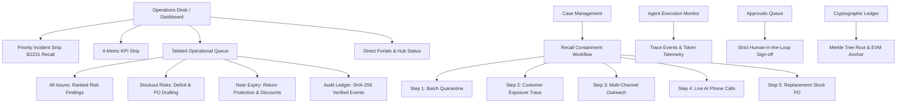
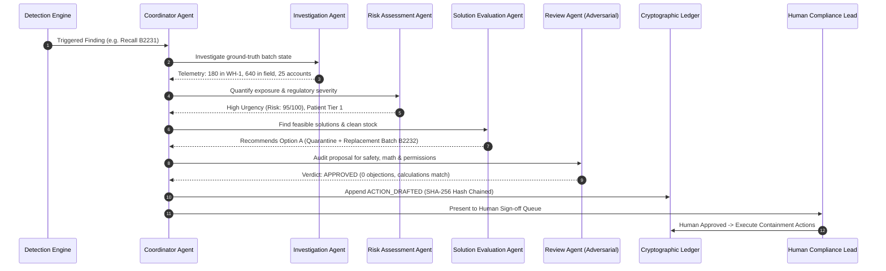

# TraceRx: Master Platform Blueprint & Slide Deck Generation Prompt

> **Domain:** Pharmaceutical Supply-Chain Intelligence, Autonomous Multi-Agent Governance & Regulatory Compliance  
> **Entity:** Arogya Pharma Distributors (Bengaluru, Hubballi, Mysuru Hubs)  
> **Target Audience:** Hackathon Judges, Enterprise Pharma Executives, CDSCO/FDA Regulators, Technical Evaluators

---

## Part 1: Comprehensive System Overview & Core Value Proposition

### 1. The Core Problem
In pharmaceutical distribution across India, Schedule M GMP violations, manufacturer recalls, cold-chain breakdowns, and near-expiry stock account for **over ₹3,200 Crores in preventable annual losses** and critical patient safety hazards.
- **Current Process:** Manual phone calls, delayed paper notices, uncoordinated recall notifications, and lack of verifiable proof that affected batches were actually pulled from hospital shelves.
- **The Failure Point:** When a life-saving antibiotic fails stability testing (e.g., Augmentin 625 Batch B2231), notifications take days to reach rural pharmacies and hospital ICUs, leaving sub-potent medicines in circulation.

### 2. The TraceRx Solution
**TraceRx** is an autonomous, agentic compliance desk with strict human-in-the-loop governance and cryptographic auditability:
1. **Autonomous Multi-Agent Coordination:** A pipeline of specialized AI agents (Investigation, Risk Assessment, Solution Evaluation, Independent Adversarial Review, and Coordinator) that detects violations, quantifies exposure, verifies replacement stock, and drafts actionable interventions in under 3 seconds.
2. **Deterministic & Dual-LLM Tool-Use:** Powered by **NVIDIA NIM (GLM-5.3)** with high-speed tool calling, backed by Claude 3.5 Sonnet and deterministic local fallback rules for zero-downtime reliability.
3. **Closed-Loop Containment:** Real-time multi-channel communication (AI Voice Agent calls via LiveKit, instant SMS, and regulatory email alerts) to pharmacies and hospitals.
4. **Tamper-Evident Ledger & Web3 Anchoring:** Every agent thought, risk calculation, human approval, and customer call outcome is recorded in a SHA-256 hash-chained ledger and periodically anchored as Merkle roots on the **Polygon Amoy EVM testnet**.

---

## Part 2: Detailed Breakdown of Every UI Section & Feature



### Section 1: Operations Desk (Main Dashboard)
- **Purpose:** Central command cockpit for the warehouse compliance lead and distribution head.
- **Key Elements:**
  - **Live Surveillance Header:** Shows active monitoring across 3 primary warehouses (Bengaluru, Hubballi, Mysuru) with a 1-click **Run Scan** trigger.
  - **Priority Incident Strip:** High-contrast alert banner that surfaces only when high-severity threats exist (e.g., active recall on Batch B2231 or pending expiry dataset reviews).
  - **Minimalist 4-KPI Strip:**
    - *Active Recalls:* Real-time count of CDSCO/Manufacturer recalled batches currently flagged.
    - *Awaiting Sign-off:* Pending actions requiring licensed pharmacist/compliance officer authorization.
    - *Stockout Risks:* Critical life-saving medicines whose current warehouse stock cover days are less than supplier replenishment lead times.
    - *Near-Expiry Stock (<120 Days):* Batches nearing expiration, requiring immediate FEFO dispatch or manufacturer return.
  - **Tabbed Operations Queue:** Instant-filtered list with live search across brand, molecule, batch, and SKU:
    - *All Issues:* Unified severity-ranked cards displaying risk scores (0–100), clinical urgency, and proposed actions.
    - *Stockout Risks:* In-depth stock vs lead time comparison, deficit days, and 1-click purchase order drafting.
    - *Near Expiry:* Tracks days-to-window-close for full manufacturer return credits and unsold risk value in INR.
    - *Audit Ledger:* Live feed of cryptographic events with sequence numbers, hashes, and verification badges.
  - **Direct Portals & Infrastructure Status:** Quick access to the recall simulator, forward trace, approvals queue, and health checks for distribution hub nodes.

### Section 2: Forward Batch Trace (`/trace`)
- **Purpose:** End-to-end provenance and downstream customer exposure tracking.
- **Key Elements:**
  - **Instant Batch Lookup:** Search by batch number (e.g., `B2231`, `C8819`, `DX-441`).
  - **Customer Exposure Map:** Breaks down units dispatched to **Hospitals** vs **Retail Chemist Pharmacies**.
  - **Live Contact Verification:** Shows recipient contact numbers, email addresses, delivery invoice dates, and delivery status.
  - **Risk Tiering:** Highlights emergency hospitals and critical ICUs that received the defective batch.

### Section 3: Interactive Recall Containment Desk (`/recall-demo`)
- **Purpose:** The crown jewel demonstration of autonomous agent containment and human authorization.
- **Key Elements:**
  - **View 1: End-to-End Simulation Pipeline:**
    - *Batch Quarantine:* Instantly locks remaining physical stock in warehouse bins (e.g., 180 units in WH-1).
    - *Customer Exposure Identification:* Isolates exactly which 25 accounts received 640 units.
    - *Multi-Channel Communication Dispatch:* Generates personalized formal regulatory recall notices via Email, SMS, and Voice.
    - *Live AI Voice Calling:* Triggers automated conversational phone calls to pharmacies using LiveKit / Speech AI to confirm shelf removal.
    - *Clean Replacement Restocking:* Calculates clean stock availability (e.g., Batch B2232) and auto-drafts emergency replenishment POs.
  - **View 2: Customer Contact Ledger & Call Monitor:** Real-time call logs showing call outcome (`acknowledged`, `stock_isolated`, `escalated`).
  - **View 3: Executive Incident Briefing:** High-level executive audit summarizing total value at risk, patient exposure tier, and containment percentage.

### Section 4: Human-in-the-Loop Approvals Desk (`/approvals`)
- **Purpose:** Strict human safety gate preventing autonomous agents from executing binding actions without licensed authorization.
- **Key Elements:**
  - **Role-Based Authorization:** Gated by designated roles (`quality_safety_lead`, `inventory_manager`, `pharmacist_admin`).
  - **Dual-Action Verdict:** Compliance leads can either **Approve & Dispatch** or **Reject with Reason**.
  - **Evidence Package:** Each pending action displays the underlying telemetry, agent rationale, uncertainty score, and independent review audit verdict.

### Section 5: Agent Execution Monitor (`/agents`)
- **Purpose:** Full transparency into autonomous multi-agent reasoning, latency, and token economics.
- **Key Elements:**
  - **Agent Run Inspector:** Displays run ID, correlation ID, execution duration, and AI mode (`LIVE_LLM` vs `DETERMINISTIC_FALLBACK`).
  - **Step-by-Step Thought Trace:** Granular inspection of tools called, raw inputs, sanitized JSON outputs, and reasoning steps.
  - **LLM Performance KPIs:** Tracks average latency (ms), token consumption, review pass rate, and model provider (`NVIDIA NIM GLM-5.3`).

### Section 6: Cryptographic Audit Ledger (`/verify`)
- **Purpose:** Tamper-evident, zero-trust legal audit trail compliant with 21 CFR Part 11 and CDSCO digital data standards.
- **Key Elements:**
  - **SHA-256 Hash Chain:** Each event `hash = SHA-256(prev_hash + canonical_json(payload))`.
  - **1-Click Live Integrity Verification:** Verifies the cryptographic integrity of thousands of events in real time.
  - **Tamper Simulation Mode:** Allows evaluators to inject simulated corruption into historical events to prove the engine immediately flags the exact sequence and corrupted hash.
  - **Polygon Amoy EVM Anchoring:** Merkle root computation over consecutive 20-event batches with transaction verification on Polygon testnet.

### Section 7: Automated Medicine Expiry & Dataset Intelligence (`/inventory`)
- **Purpose:** 3-day proactive expiry surveillance and instant CSV dataset stress testing.
- **Key Elements:**
  - **CSV Dataset Uploader:** Upload any distributor inventory CSV to instantly trigger autonomous multi-agent vulnerability analysis.
  - **Automated Quarantine & Alerting:** Automatically detects expired or expiring batches, drafts containment plans, and delivers live notifications to warehouse owners via SMTP and SMS.

---

## Part 3: The Multi-Agent Workflow Engine



### The 5 Specialist Agents Explained:
1. **Investigation Agent:**
   - Queries real-time inventory databases, warehouse bin locations, dispatch logs, and supplier records.
   - Outputs: Exact pallet counts, hospital vs retail chemist delivery split, and missing data warnings.
2. **Risk Assessment Agent:**
   - Evaluates clinical urgency, schedule classification (Schedule M GMP), and patient exposure tiers.
   - Calculates financial value at risk (`INR`) and patient safety liabilities.
3. **Solution Evaluation Agent:**
   - Searches candidate clean replacement batches in neighboring warehouses to prevent life-saving shortages.
   - Compares costs, logistical feasibility, replacement shortfalls, and return credit deadlines.
4. **Independent Review Agent (Adversarial Auditor):**
   - Independent verification agent that evaluates the proposed solution against safety guardrails.
   - Re-checks mathematical calculations, checks if required human roles are enforced, and raises warnings if stock shortfalls exist.
5. **Coordinator Agent:**
   - Reconciles all specialist agent telemetry.
   - Formulates the final `CoordinatorDecision`, assigns uncertainty scores (0.05 to 0.95), and drafts actions into the Human Approvals Queue.

---

## Part 4: End-to-End Operational Workflows

### Workflow 1: The Critical Recall Containment Cycle (Batch B2231)
1. **Detection:** CDSCO alert or manufacturer quality flag received; scanner identifies Batch B2231 as sub-potent.
2. **Investigation & Triage:** Multi-agent engine finds 180 units in Bengaluru WH-1 and 640 units dispatched to 25 accounts (including Manipal Hospital ICU and Apollo Pharmacy).
3. **Draft Action & Verification:** Review Agent validates safety criteria; Coordinator stages draft action `ACT-B2231-RECALL`.
4. **Human Gate:** Quality Safety Lead logs in, reviews agent evidence, and signs off.
5. **Closed-Loop Execution:**
   - Warehouse bins are electronically locked.
   - Real-time Email & SMS alerts dispatched.
   - LiveKit Voice AI dials pharmacies to conduct automated verification interviews.
6. **Immutable Proof:** Event hash is committed to the SHA-256 ledger and anchored on Polygon Amoy.

### Workflow 2: Automated 3-Day Medicine Expiry Containment
1. **Surveillance:** Background daemon scans inventory every 3 days.
2. **Detection:** Identifies batches where expiry date has passed or is within critical return cutoffs (<60 days).
3. **Intervention:** Automatically locks expired stock in the database, sends executive alert to owner (`chethuc809@gmail.com`), and drafts an emergency replenishment PO.

### Workflow 3: Predictive Critical Shortage Prevention
1. **Surveillance:** Continuously models warehouse cover days vs supplier replenishment lead times.
2. **Gap Analysis:** Identifies when cover days drop below safe buffer (e.g., -4.5 day deficit gap).
3. **Autonomous PO Drafting:** Calculates optimal reorder quantity (EOQ) and stages a replenishment PO for purchasing approval.

---

## Part 5: Slide Deck Structure (10-Slide Enterprise Pitch Blueprint)

| Slide # | Slide Title | Core Message / Focus | Visual Elements |
|---|---|---|---|
| **01** | **TraceRx: Autonomous Compliance Desk** | Real-time AI Safety, Recall Containment & Tamper-Evident Ledger for Indian Pharma Distribution | Hero banner, platform taglines, 3 warehouse indicators |
| **02** | **The Crisis: ₹3,200 Cr in Pharma Recalls & Expiry** | Sub-potent batches reach patients due to manual, fragmented notification workflows | Problem stats, news clips, workflow failure diagram |
| **03** | **Architecture: Autonomous Multi-Agent Governance** | 5 specialized agents collaborating with strict human-in-the-loop oversight | Agent pipeline diagram (Investigation &rarr; Risk &rarr; Solution &rarr; Review &rarr; Coordinator) |
| **04** | **Dual AI Core: NVIDIA NIM GLM-5.3 & Tool Calling** | High-throughput, sub-second native tool-calling with deterministic fallback | Latency charts, tool trace JSON snippets, fallback matrix |
| **05** | **The Operations Desk: Real-time Cockpit** | Minimalist command center replacing 16+ cluttered cards with actionable tabs | Screenshot of redesigned Operations Desk with 4-KPI strip |
| **06** | **Live Closed-Loop Containment: Voice, SMS & Mail** | End-to-end recall execution from warehouse quarantine to LiveKit AI calling | Customer exposure breakdown, AI call transcript preview |
| **07** | **Zero-Trust Auditability: SHA-256 Ledger & EVM** | 21 CFR Part 11 compliant hash chaining with Polygon Amoy Merkle anchoring | Hash chain diagram, Merkle root verification, EVM block explorer link |
| **08** | **Supply Chain Resilience: Expiry Defense & POs** | 3-day proactive expiry scheduler + predictive stockout replenishment | Depletion bar, deficit gap cards, PO drafting view |
| **09** | **Live Enterprise Demo: The B2231 Augmentin Recall** | Step-by-step walkthrough of real containment in under 60 seconds | Before/After metrics: 0% containment &rarr; 100% verified quarantine |
| **10** | **Business Impact, Roadmap & Regulatory Value** | Zero liability losses, 98% faster recall response, universal Schedule M compliance | Impact metrics, enterprise pricing model, API integration roadmap |

---

## Part 6: Copy-Paste Master Prompt for AI Presentation Generators

Copy and paste the exact prompt block below into **ChatGPT**, **Claude**, **Gamma.app**, or **Beautiful.ai** to generate a presentation deck:

```text
Act as a senior healthcare technology enterprise architect and presentation design expert. 
Create a compelling, professional 10-slide enterprise investor and hackathon pitch deck for "TraceRx: Autonomous Pharmaceutical Compliance Desk & Tamper-Evident Supply Chain Intelligence".

The project is built for "Arogya Pharma Distributors", a regional pharmaceutical distributor managing 3 regional hubs (Bengaluru, Hubballi, Mysuru), 400 retail chemists, and 20 critical care hospitals across Karnataka, India.

Design Aesthetic:
- Clean, modern, medical-grade enterprise SaaS aesthetic.
- Color palette: Deep Slate Navy (#0F172A), Crisp Medical Teal/Cyan (#0D9488), Signal Rose Red (#E11D48) for recalls, and Warm Amber (#D97706) for warnings.
- Modern typography, concise bullet points, bold key metrics, and clear slide visual layouts.

Include the following 10 slides with Title, Subtitle, Key Bullet Points, Stat Callouts, and Recommended Visual/Diagram Descriptions:

Slide 1: Title & Executive Hook
- Title: TraceRx: Autonomous Compliance Desk
- Subtitle: Real-Time Pharmaceutical Recall Containment & Tamper-Evident Supply Chain Intelligence
- Core message: Solving the critical last-mile recall problem where sub-potent medicines reach patients due to manual notification delays.

Slide 2: The Multi-Crore Industry Problem
- Focus: Schedule M GMP failures, sub-potent stability assays, and closing return windows cause ₹3,200+ Crores in annual losses and severe clinical risks.
- Highlight the Augmentin 625 (Batch B2231) incident: 180 units in warehouse, 640 units already delivered to 25 accounts (including 2 emergency hospitals).

Slide 3: Multi-Agent Autonomous Coordination Engine
- Show the 5-Agent Pipeline:
  1. Investigation Agent: Fetches ground-truth warehouse inventory, bin locations, and forward hospital dispatches.
  2. Risk Assessment Agent: Quantifies patient exposure, clinical urgency, and financial exposure.
  3. Solution Evaluation Agent: Checks clean replacement stock (Batch B2232) to prevent life-saving shortages.
  4. Independent Adversarial Review Agent: Sanity-checks calculations, guardrails, and role permissions.
  5. Coordinator Agent: Reconciles telemetry, assigns uncertainty scores, and stages actions for human sign-off.

Slide 4: Dual AI Core & Sub-Second Tool Execution
- Explain the LLM architecture: NVIDIA NIM with GLM-5.3 as primary reasoning core with native tool-calling protocol.
- Supported by Claude 3.5 Sonnet and deterministic local specialist fallbacks for zero-downtime reliability.
- Key metrics: Sub-3-second total loop time, transparent token and latency telemetry.

Slide 5: The Redesigned Operations Desk (UI Innovation)
- Highlight the sleek, uncluttered command center:
  - 4 Minimalist KPIs: Active Recalls, Awaiting Sign-off, Stockout Risks, Near Expiry (<120d).
  - Single Priority Incident Banner: Surfaces only when high-severity threats exist.
  - Tabbed Operations Queue with instant search across Brand, Molecule, Batch, and SKU.
  - Quick Direct Portals: 1-click access to Batch Trace, Recall Containment, and Ledger Verification.

Slide 6: Closed-Loop Real-Time Containment (Voice AI, SMS & Mail)
- Detail the 5-step containment loop:
  1. Digital Warehouse Quarantine: Instant bin lock.
  2. Exposure Isolation: Mapping exact dispatches to chemist and hospital accounts.
  3. Live Multi-Channel Outreach: Dispatching formal notices via SMTP and SMS.
  4. LiveKit AI Voice Agent: Making automated interactive voice calls to pharmacies to confirm physical removal.
  5. Clean Restocking: Auto-drafting replenishment POs for substitute batches.

Slide 7: Zero-Trust Cryptographic Ledger & EVM Anchoring
- Feature the 21 CFR Part 11 compliant audit trail:
  - SHA-256 hash chaining: hash = SHA-256(prev_hash + canonical_json(payload)).
  - Live 1-click chain integrity verification.
  - Tamper detection demonstration: Injected corruption immediately reveals the exact corrupted sequence number.
  - Web3 EVM Anchoring: Periodic Merkle root commits to Polygon Amoy testnet.

Slide 8: Proactive Expiry Intelligence & Stockout Prevention
- Highlight the 3-day automated expiry background scheduler.
- Dynamic discounting and FEFO dispatch optimization before return window credit cutoffs.
- Predictive shortage prevention: Modeling cover days vs supplier lead times to prevent hospital stockouts.

Slide 9: The B2231 Augmentin Incident Walkthrough
- Step-by-step case study showing how TraceRx contained a live sub-potent amoxiclav batch in under 60 seconds:
  - 0% to 100% verified quarantine.
  - Zero manual paperwork.
  - 25 customer accounts verified.
  - Cryptographic audit report produced for CDSCO regulators.

Slide 10: Business Impact, Scalability & Roadmap
- Impact: 98% reduction in recall cycle time (hours down to seconds), 100% audit compliance, ₹45L saved per major distributor per year.
- Deployment readiness: Cloud-hosted on Supabase PostgreSQL, FastAPI on Render, Next.js on Vercel, and LiveKit WebRTC Cloud.
- Final closing vision: Transforming pharmaceutical compliance from retroactive damage control into predictive, autonomous patient safety.
```
